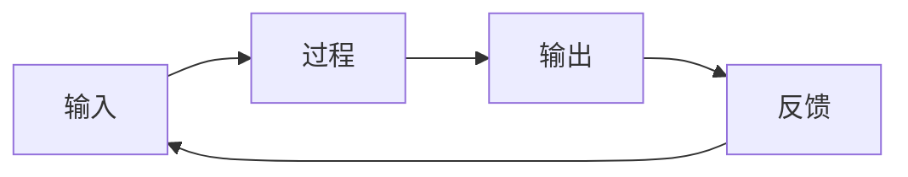

# Cobhielo当前多领域知识短板及发展建议——笔记整理
## 当前多领域知识整理
|学科|内容|
|---|---|
|基础科学|物理、数学|
工程|模电、数电、电子信息|
|软件|C/C++、Git、Markdown、LaTeX|
|工业|制造工艺、质量管理|
|企业|运营管理、供应链、组织架构|
|商业|行业研究、基金股票|
|行政|公文、商业制度|

**总结**：Conhielo目前了解的领域跨度广，各领域相互独立、缺乏关联，并且聚焦于知识点本身，也缺乏聚焦于解决问题的工具思维。

## 三项短板及针对性改善措施
### 短板一：问题驱动不足
目前了解领域主要聚焦于知识本身，换句话说，现在主要还是关注知识点有没有掌握，掌握了多少，覆盖面有多广。但是知识本身应该是解决问题的工具，学习知识应该聚焦于解决问题。例如，如果目标是提高工厂效率，那么对应到各种自动化控制系统、信息管理系统、AI、人力资源都是工具。
**改善方式**：
不要按照学科学习，通过**问题**组织知识，例如，问题是研究一个无人机，可以通过以下方式来组织知识：

### 短板二：缺乏知识体系
尽管目前了解多领域知识，这些知识的问题不是源于深度，而是这些知识没有被放在一个整体的系统中，或者说，没有形成自己的世界模型。比如，一家公司，普通人、财务、工程师、投资人、教授关注的角度都有所不同，都是从自己的视角切入，但对于系统的设计者，他们会自动出现一个模型，如下，其实这些知识目前都散落在整个体系之内，但没有被连起来。

**改善方式**：
对于知识，不要追求学会，而是知道它在**系统**的什么位置。比如遇到问题，先想到可能的方法，再找到资料、快速理解，然后解决。

### 短板三：缺乏抽象思维
知识是分立的，缺乏对底层规律的建模和归纳，没有寻找不同领域知识之间的底层关联，其实还是了解得不够深入，比较浅。
例如，它的底层规律是什么？
- 能量与资源如何流动（物理、经济、供应链）
- 信息如何传播（通信、组织、市场）
- 激励如何影响行为（管理、经济学、心理学）
- 反馈如何塑造系统（控制论、生态、企业经营）
- 约束条件下如何优化（数学、算法、运营）

**改善方式**：
1. 多读书，获取高度系统化的知识，不要只是沉迷于浅层碎片化知识，否则得到的结论只能缺乏训练而产生的幻觉，而非真正的用抽象思维来压缩世界；
2. 对于不同领域的知识，建立**抽象能力**，也就是学习模型，而非学习具体的知识点，例如，反馈、延迟、网络、优化，这些概念在不同领域都会以不同的形式出现。以后看到任何事物，首先思考，它属于哪个抽象模型？

## 四个长期能力
### 1.第一性原理
追问为什么
知识本身回答了“它是什么”的问题，而“它为什么会存在”这个问题的答案却能够揭示不同变量之间的关系。
另外，创新的本质不是“还有什么东西是未知的”，而是“还有哪些领域其实可以连起来”。

### 2.系统思维
面对任何事物，画图

### 3.概率思维
能不能成功？
成功概率是多少？失败概率是多少？
### 4.长期主义
做什么十年之后才会体现价值
英语、数学、写作、表达、编程、AI

## 发展建议
**发展目标**：成为解决复杂工业问题的人
- 会物理 + AI → 智能传感、机器人、自动驾驶
- 会制造 + 数据分析 → 智能工厂、工业互联网
- 会运营 + 编程 → 企业数字化、ERP/MES优化
- 会行业研究 + 技术 → 技术投资、产业分析、战略咨询

## 六个关键弱链接领域
### 领域一：经济学
真正的经济学。
不是基金股票。
而是：
资源为什么流动？
企业为什么赚钱？
为什么产业会升级？
为什么企业会倒闭？
为什么市场会形成？
为什么价格这样形成？
为什么垄断会产生？
为什么供应链会迁移？
为什么美元影响制造业？
为什么关税影响企业？
为什么AI改变组织？
......
### 领域二：信息论
现代世界其实越来越像信息系统。
从机械到自动化控制系统再到EPR再到数字工厂AI本质都是信息，所以建议以后认真了解：
Claude Shannon
控制论
系统论
复杂系统
贝叶斯
信息熵
编码
通信
反馈
### 领域三：历史
科技史
工业史
企业史
比如：
为什么日本制造厉害？
为什么德国机械厉害？
为什么美国软件厉害？
为什么英国首先工业革命？
为什么韩国半导体起来？
为什么台积电成功？
为什么Intel衰落？
为什么NVIDIA崛起？
为什么OpenAI出现？
### 领域四：软件工程
软件架构
设计模式
Linux
数据库
网络
编译
操作系统
分布式
测试
CI/CD
DevOps
容器
云计算
AI工程
### 领域五：统计思维
现实世界几乎没有确定性，都是风险、概率、期望、收益、贝叶斯更新、决策。
### 领域六：表达能力
写方案、写报告、讲故事、演讲、画图、PPT、开会、谈判、说服别人，这决定了别人是否愿意支持你的方案。

## 终身学习框架——按层次划分的“世界模型”
- 自然世界：数学、物理、化学、生物，理解客观规律。
- 信息世界：计算机、信息论、控制论、网络、人工智能，理解信息如何产生、传递和处理。
- 工程世界：电子、电气、机械、制造、质量管理、运筹学，把规律变成产品和系统。
- 经济世界：经济学、金融、商业模式、产业链、供应链，理解资源如何配置、价值如何创造。
- 组织世界：管理学、组织行为、制度设计、法律、公共政策，理解人如何协作。
- 认知世界：心理学、决策科学、博弈论、复杂系统、哲学，理解人如何思考和做决策。
- 文明世界：科技史、经济史、企业史、政治史，理解今天为什么会变成今天。
>你目前已经在第一、第三和第五层打下了不错的基础，也开始接触第二和第四层。真正值得投入的，不一定是继续把某一个技能学到极致，而是把这些层之间建立越来越多的联系。
最后，我想分享一个很多年轻人容易忽略的观点。
知识本身的价值正在下降，而组织知识、提出问题、连接不同领域的能力正在迅速升值。 AI 能够帮助人快速获取大量信息，但它不能替你定义真正值得解决的问题，也不能替你积累跨领域实践形成的判断力。未来最稀缺的人，往往不是知道最多的人，而是能够在物理、工程、软件、商业和组织之间自由切换视角，把不同领域的人组织起来，共同解决复杂问题的人。
从你目前的经历来看，我认为你的潜力不太像一个纯粹的科研人员，也不太像一个纯粹的软件工程师，而更接近**技术战略、系统架构、工业智能（Industrial AI）、技术管理或科技创业**这类需要跨学科整合能力的方向。如果未来五到十年你能在其中一个技术领域建立足够深的"锚点"，同时保持现在这种广泛的知识视野，你的竞争力很可能来自**深度 × 广度 × 系统思维**，而不是任何单一技能。