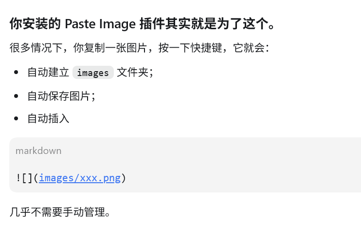
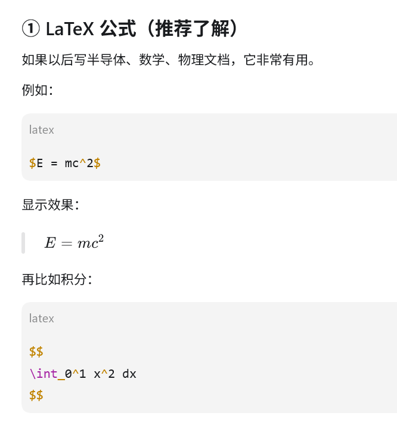

# 一级标题

## 二级标题 

正文文本

**加粗**

*斜体*

- 无序列表
- 无序列表

1. 有序列表
2. 有序列表

> 引用

---


` 代码 `



**图 1　Markdown 图片示例**
<p align="center">图 1　Markdown 图片示例</p>

***

```
代码块


```
| 左对齐 | 居中对齐 | 右对齐 |
|:----|:---:|----:|
| a | b | c |

[Pinterest](https://pinterest.com/)

- [x] 标题
- [x] 图片
- [x] 链接
- [ ] 公式

<p align="center">

</p>

$E = mc^2$

$
\int_0^1 x^2 dx
$

$x^2$

$H_2O$

$
\begin{Bmatrix}
a & b\\
c & d
\end{Bmatrix}
$

- [x] Markdown 基础
- [x] GitHub 基础
- [ ] Mermaid 流程图
- [ ] LaTeX 常见公式公式
- [ ] HTML 基础

$
\begin{bmatrix}
1&2\\
3&4
\end{bmatrix}
$

$
\frac{1}{2}
\alpha
\beta
\gamma
\lambda
\sum_{i=1}^{n}
\frac{\partial f}{\partial x}
$